# イベント管理アプリ 設計書

## 1. プロジェクト概要

### 1.1 プロジェクト名
CEO倶楽部 イベント管理アプリ（仮称）

### 1.2 目的
会員向けイベント情報の配信、申込み管理、会員証機能を提供するモバイルアプリケーション

### 1.3 対象ユーザー
| ユーザー種別 | 説明 |
|-------------|------|
| 会員 | アプリを利用してイベント閲覧・申込みを行う |
| 非会員 | 外部リンク経由でイベント申込みのみ可能 |
| 管理者 | 管理画面でイベント・会員を管理する本部スタッフ |

### 1.4 規模想定
| 項目 | 数値 |
|------|------|
| 会員数 | 1,000〜10,000人 |
| 同時接続数 | 50人未満 |
| 管理者数 | 複数人（権限分けなし） |

---

## 2. システム構成

### 2.1 全体アーキテクチャ

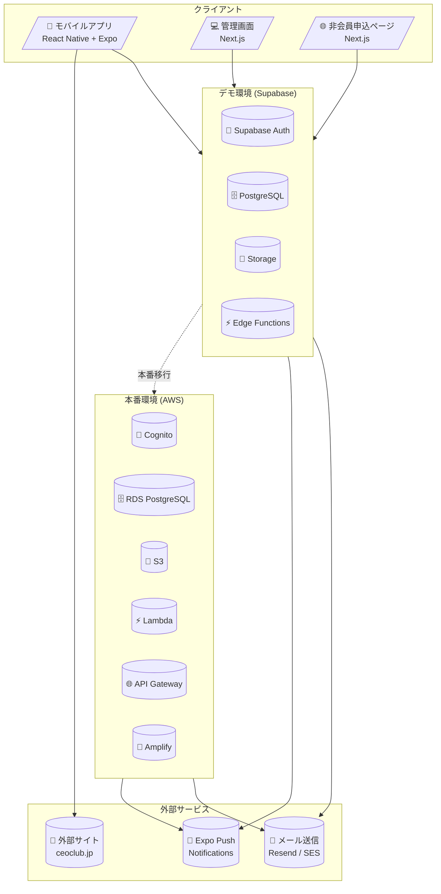

### 2.2 デモ環境構成（Supabase）

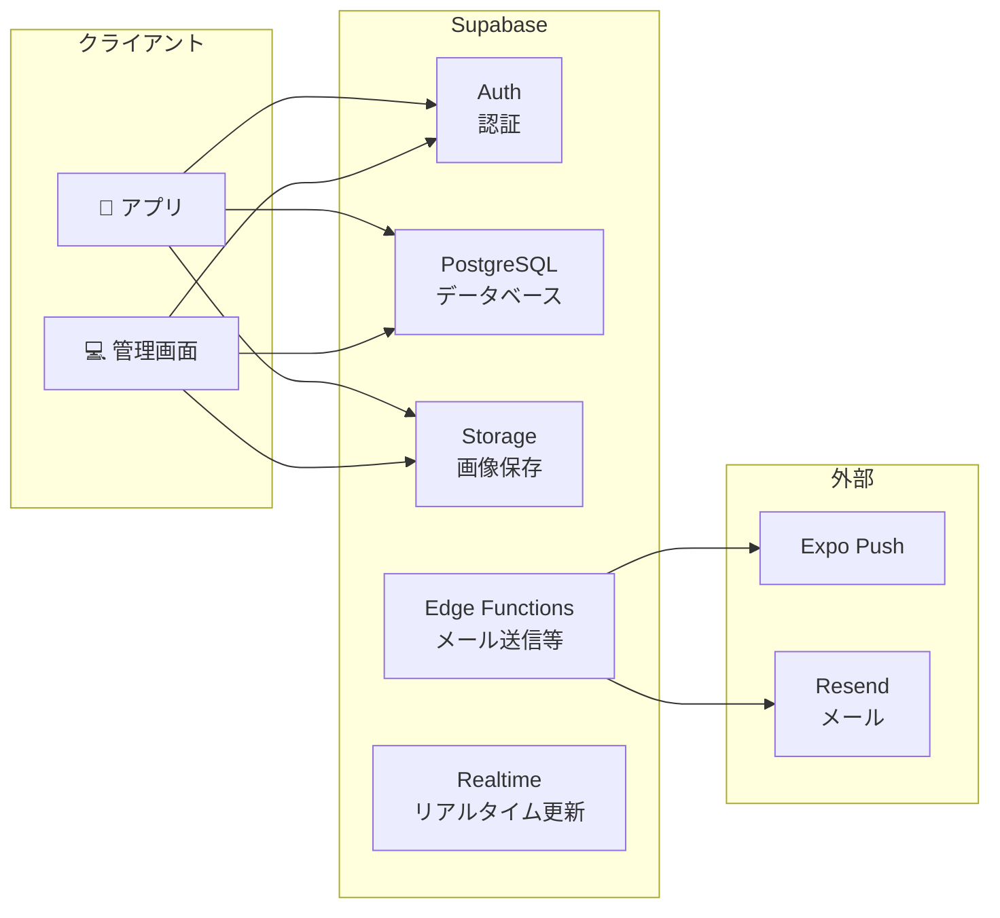

### 2.3 本番環境構成（AWS）

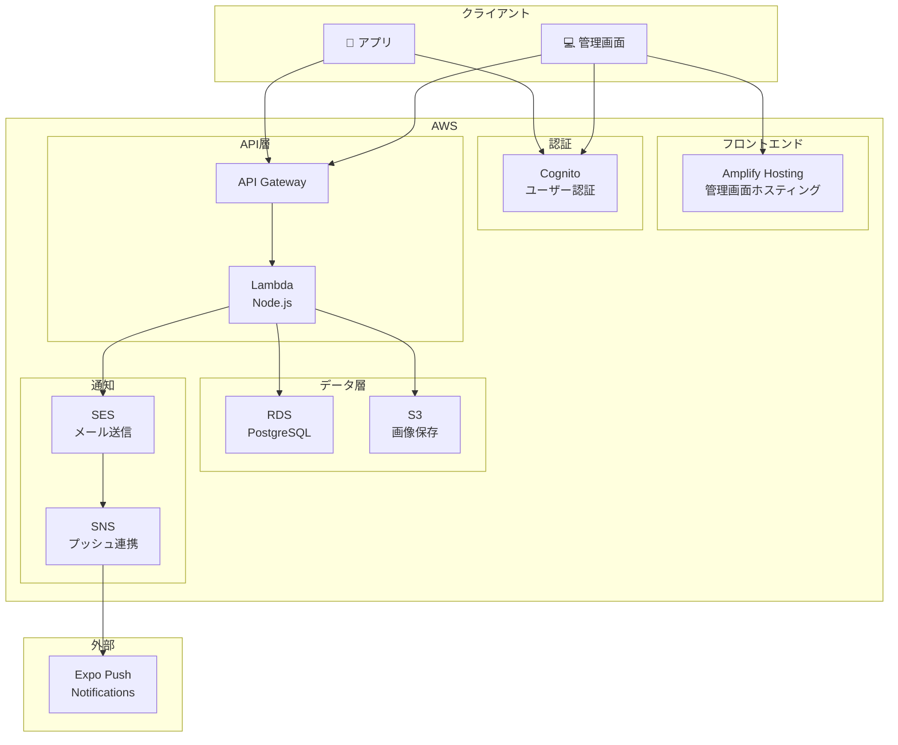

---

## 3. 技術スタック

### 3.1 デモ環境

| レイヤー | 技術 | バージョン |
|---------|------|-----------|
| モバイルアプリ | React Native + Expo | SDK 52+ |
| 管理画面 | Next.js | 15.x |
| UIライブラリ | Tailwind CSS / NativeWind | - |
| BaaS | Supabase | - |
| 認証 | Supabase Auth | - |
| データベース | PostgreSQL (Supabase) | 15.x |
| ストレージ | Supabase Storage | - |
| プッシュ通知 | Expo Push Notifications | - |
| メール送信 | Resend | - |
| リッチエディタ | TipTap (管理画面) | - |

### 3.2 本番環境

| レイヤー | 技術 | 備考 |
|---------|------|------|
| モバイルアプリ | React Native + Expo | 変更なし |
| 管理画面 | Next.js + Amplify | Amplifyでホスティング |
| 認証 | Amazon Cognito | Supabase Authから移行 |
| API | API Gateway + Lambda | Node.js 20.x |
| データベース | Amazon RDS PostgreSQL | Supabaseから移行 |
| ストレージ | Amazon S3 | Supabase Storageから移行 |
| メール送信 | Amazon SES | Resendから移行 |
| プッシュ通知 | Expo Push Notifications | 変更なし |

---

## 4. 機能一覧

### 4.1 モバイルアプリ機能

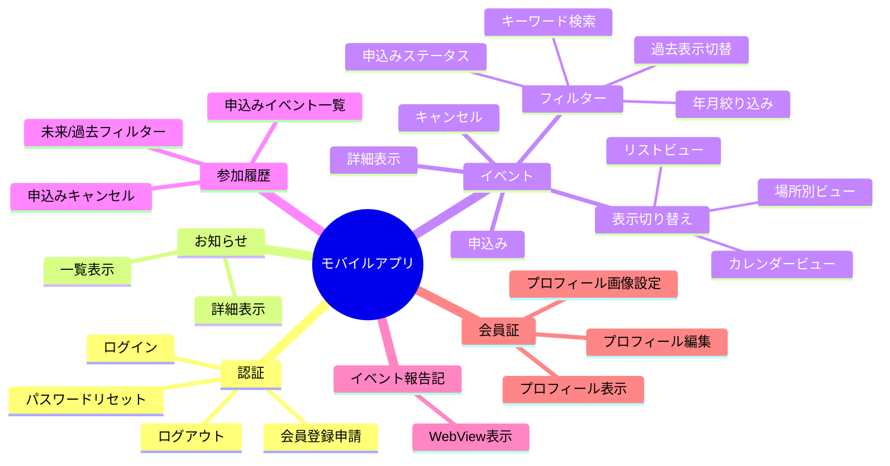

### 4.2 管理画面機能

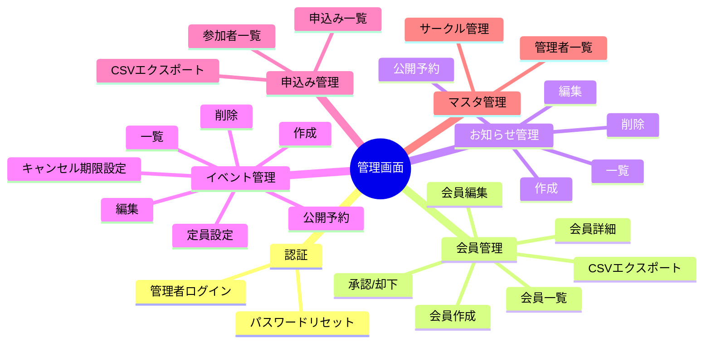

### 4.3 機能詳細

#### 4.3.1 認証機能

| 機能 | 会員 | 非会員 | 管理者 |
|------|:----:|:------:|:------:|
| ログイン | ✅ | - | ✅ |
| 会員登録申請 | ✅ | - | - |
| パスワードリセット | ✅ | - | ✅ |
| ログアウト | ✅ | - | ✅ |

#### 4.3.2 お知らせ機能

| 機能 | 説明 |
|------|------|
| 一覧表示 | 投稿日時、タイトル、サムネイル表示 |
| 詳細表示 | 本文（リッチテキスト）表示 |
| 公開予約 | 指定日時に自動公開 |

#### 4.3.3 イベント機能

##### 基本機能

| 機能 | 説明 |
|------|------|
| 詳細表示 | 本文（リッチテキスト）、申込みフォーム |
| 申込み（会員） | ログイン情報から自動取得、参加意思表示のみ |
| 申込み（非会員） | メールアドレス、氏名、企業名、役職を入力 |
| 定員管理 | 満員時は申込み不可 |
| キャンセル | キャンセル期限まで可能 |
| 外部リンク共有 | 非会員向けに申込みページURLを共有可能 |

##### 一覧表示

| 項目 | 説明 |
|------|------|
| 表示項目 | 日付、タイトル、サムネイル、開催日時、場所、申込みステータス |
| 申込みステータス | 「申込済」「未申込」をアイコンやラベルで表示 |
| 初期表示 | 未来のイベントのみ表示 |
| 過去表示 | フィルターで「過去のイベントも表示」ON時のみ表示 |

##### 表示切り替え（タブ）

| タブ | 説明 |
|------|------|
| リスト | イベントを時系列リストで表示 |
| カレンダー | カレンダー形式で表示 |
| 場所別 | 開催場所ごとにグループ化して表示 |

##### リストビュー

| 項目 | 説明 |
|------|------|
| 表示形式 | 時系列順のリスト |
| 表示項目 | サムネイル、タイトル、開催日時、場所、申込みステータス |
| タップ時 | イベント詳細画面へ遷移 |

##### カレンダービュー

| 項目 | 説明 |
|------|------|
| 表示切り替え | 月表示 / 週表示 を切り替え可能 |
| イベント表示 | 日付セルにドット表示、イベントあればタイトルも表示 |
| 日付タップ時 | その日のイベント一覧をモーダルまたは下部に表示 |
| イベントタップ時 | イベント詳細画面へ遷移 |

##### 場所別ビュー

| 項目 | 説明 |
|------|------|
| 表示対象 | 未来のイベントの開催場所一覧 |
| 場所データ | 自由入力テキスト（マスタ管理なし） |
| 場所タップ時 | その場所で開催されるイベント一覧を表示 |
| イベントタップ時 | イベント詳細画面へ遷移 |

##### フィルター機能

| フィルター | 説明 |
|------------|------|
| 年月 | 年・月を選択して絞り込み |
| 過去表示 | 「過去のイベントも表示」トグルスイッチ |
| 申込みステータス | 「申込済のみ」「未申込のみ」「すべて」 |
| キーワード | タイトル・場所でキーワード検索 |

#### 4.3.4 参加履歴機能

| 機能 | 説明 |
|------|------|
| 一覧表示 | 自分が申込んだイベントの一覧 |
| 表示項目 | イベント名、開催日時、場所、申込みステータス |
| 初期表示 | 未来のイベント（これから開催）のみ表示 |
| キャンセル | キャンセル期限内であれば一覧からキャンセル可能 |
| 詳細遷移 | タップでイベント詳細画面へ遷移 |

##### フィルター機能

| フィルター | 説明 |
|------------|------|
| 過去表示 | 「過去のイベントも表示」トグルスイッチ |
| 年月 | 年・月を選択して絞り込み |
| キーワード | タイトル・場所でキーワード検索 |

#### 4.3.5 イベント報告記機能

| 機能 | 説明 |
|------|------|
| WebView表示 | 外部サイト（https://ceoclub.jp/news/ncat/report/）を表示 |

#### 4.3.6 会員証機能

| 項目 | 入力形式 | 必須 |
|------|----------|:----:|
| プロフィール画像 | 画像アップロード | - |
| メールアドレス | テキスト | ✅ |
| パスワード | パスワード変更 | ✅ |
| 性別 | ラジオボタン（男性/女性/回答しない） | - |
| 生年月日 | DatePicker | - |
| 会社名 | テキスト | - |
| 所属サークル | 複数選択モーダル | - |
| 地区会 | テキスト | - |

---

## 5. 画面設計

### 5.1 モバイルアプリ画面遷移

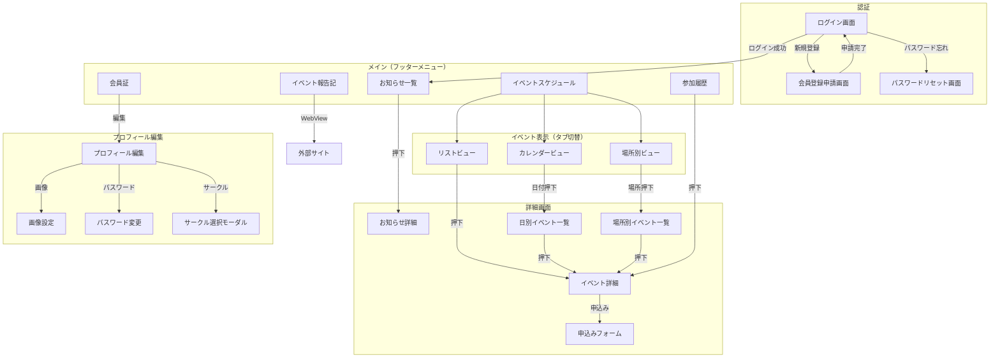

### 5.2 画面一覧

#### モバイルアプリ

| No | 画面名 | パス | 説明 |
|----|--------|------|------|
| 1 | ログイン | `/login` | メールアドレス・パスワード入力 |
| 2 | 会員登録申請 | `/register` | 新規会員登録申請フォーム |
| 3 | パスワードリセット | `/reset-password` | メールアドレス入力 |
| 4 | お知らせ一覧 | `/news` | お知らせリスト表示 |
| 5 | お知らせ詳細 | `/news/[id]` | お知らせ本文表示 |
| 6 | イベントスケジュール | `/events` | イベント一覧（リスト/カレンダー/場所別タブ切替、フィルター） |
| 7 | イベント詳細 | `/events/[id]` | イベント本文・申込みフォーム |
| 8 | 参加履歴 | `/history` | 申込みイベント一覧（未来/過去フィルター） |
| 9 | イベント報告記 | `/reports` | WebView表示 |
| 10 | 会員証 | `/member` | プロフィール表示 |
| 11 | プロフィール編集 | `/member/edit` | プロフィール編集フォーム |

#### 管理画面

| No | 画面名 | パス | 説明 |
|----|--------|------|------|
| 1 | ログイン | `/admin/login` | 管理者ログイン |
| 2 | ダッシュボード | `/admin` | 統計情報表示 |
| 3 | 会員一覧 | `/admin/members` | 会員リスト・検索・CSVエクスポート |
| 4 | 会員詳細 | `/admin/members/[id]` | 会員情報詳細・編集 |
| 5 | 会員作成 | `/admin/members/new` | 新規会員作成 |
| 6 | 承認待ち一覧 | `/admin/members/pending` | 承認待ち会員リスト |
| 7 | お知らせ一覧 | `/admin/news` | お知らせリスト |
| 8 | お知らせ作成/編集 | `/admin/news/[id]` | リッチエディタで作成・編集 |
| 9 | イベント一覧 | `/admin/events` | イベントリスト |
| 10 | イベント作成/編集 | `/admin/events/[id]` | リッチエディタで作成・編集 |
| 11 | 申込み一覧 | `/admin/events/[id]/applications` | イベント参加者リスト |
| 12 | 管理者一覧 | `/admin/administrators` | 管理者マスタ |
| 13 | サークル管理 | `/admin/circles` | サークルマスタ |

#### 非会員申込みページ（Web）

| No | 画面名 | パス | 説明 |
|----|--------|------|------|
| 1 | イベント申込み | `/apply/[eventId]` | 非会員向け申込みフォーム |
| 2 | 申込み完了 | `/apply/[eventId]/complete` | 申込み完了メッセージ |

---

## 6. データベース設計

### 6.1 ER図

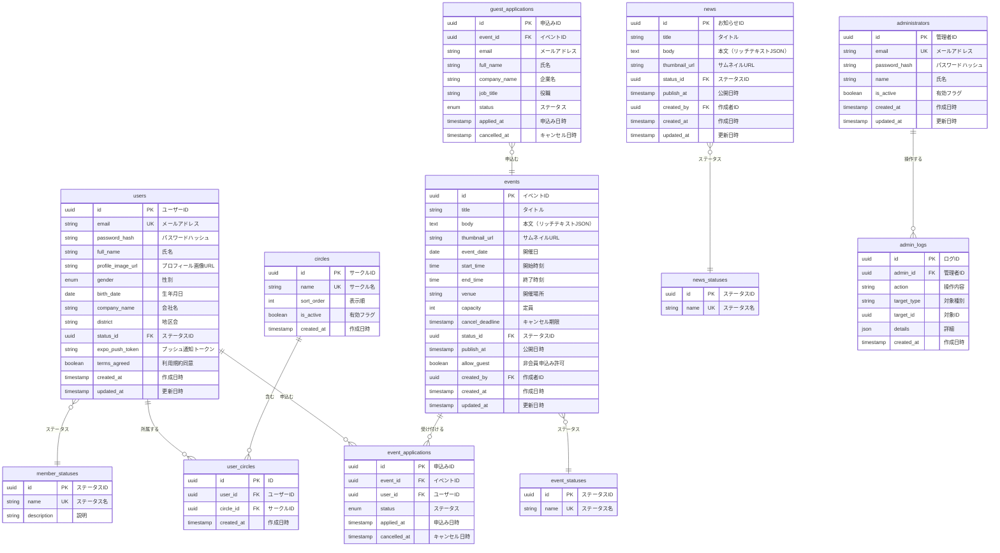

### 6.2 テーブル定義

#### users（会員）

| カラム名 | 型 | NULL | 説明 |
|----------|-----|:----:|------|
| id | UUID | NO | 主キー |
| email | VARCHAR(255) | NO | メールアドレス（ユニーク） |
| password_hash | VARCHAR(255) | NO | パスワードハッシュ |
| full_name | VARCHAR(100) | NO | 氏名 |
| profile_image_url | VARCHAR(500) | YES | プロフィール画像URL |
| gender | ENUM('male','female','other') | YES | 性別 |
| birth_date | DATE | YES | 生年月日 |
| company_name | VARCHAR(200) | YES | 会社名 |
| district | VARCHAR(100) | YES | 地区会 |
| status_id | UUID | NO | ステータスID（FK） |
| expo_push_token | VARCHAR(255) | YES | プッシュ通知トークン |
| terms_agreed | BOOLEAN | NO | 利用規約同意 |
| created_at | TIMESTAMP | NO | 作成日時 |
| updated_at | TIMESTAMP | NO | 更新日時 |

#### member_statuses（会員ステータス）

| ID | name | description |
|----|------|-------------|
| 1 | pending | 承認待ち |
| 2 | active | 有効 |
| 3 | suspended | 停止中 |
| 4 | rejected | 却下 |

#### events（イベント）

| カラム名 | 型 | NULL | 説明 |
|----------|-----|:----:|------|
| id | UUID | NO | 主キー |
| title | VARCHAR(200) | NO | タイトル |
| body | TEXT | NO | 本文（TipTap JSON） |
| thumbnail_url | VARCHAR(500) | YES | サムネイルURL |
| event_date | DATE | NO | 開催日 |
| start_time | TIME | YES | 開始時刻 |
| end_time | TIME | YES | 終了時刻 |
| venue | VARCHAR(200) | YES | 開催場所 |
| capacity | INTEGER | YES | 定員（NULLは無制限） |
| cancel_deadline | TIMESTAMP | YES | キャンセル期限 |
| status_id | UUID | NO | ステータスID（FK） |
| publish_at | TIMESTAMP | YES | 公開予約日時 |
| allow_guest | BOOLEAN | NO | 非会員申込み許可 |
| created_by | UUID | NO | 作成者ID（FK） |
| created_at | TIMESTAMP | NO | 作成日時 |
| updated_at | TIMESTAMP | NO | 更新日時 |

#### event_statuses（イベントステータス）

| ID | name |
|----|------|
| 1 | draft |
| 2 | published |
| 3 | closed |
| 4 | cancelled |

---

## 7. API設計

### 7.1 エンドポイント一覧

#### 認証API

| メソッド | エンドポイント | 説明 | 認証 |
|----------|---------------|------|:----:|
| POST | `/auth/login` | ログイン | - |
| POST | `/auth/register` | 会員登録申請 | - |
| POST | `/auth/reset-password` | パスワードリセット要求 | - |
| POST | `/auth/reset-password/confirm` | パスワードリセット実行 | - |
| POST | `/auth/logout` | ログアウト | ✅ |
| GET | `/auth/me` | ログインユーザー情報取得 | ✅ |

#### お知らせAPI

| メソッド | エンドポイント | 説明 | 認証 |
|----------|---------------|------|:----:|
| GET | `/news` | お知らせ一覧取得 | ✅ |
| GET | `/news/:id` | お知らせ詳細取得 | ✅ |

#### イベントAPI

| メソッド | エンドポイント | 説明 | 認証 |
|----------|---------------|------|:----:|
| GET | `/events` | イベント一覧取得 | ✅ |
| GET | `/events/:id` | イベント詳細取得 | ✅/- |
| POST | `/events/:id/apply` | イベント申込み（会員） | ✅ |
| DELETE | `/events/:id/apply` | 申込みキャンセル（会員） | ✅ |
| POST | `/events/:id/apply/guest` | イベント申込み（非会員） | - |
| GET | `/events/my-applications` | 自分の申込み一覧（参加履歴） | ✅ |
| GET | `/events/venues` | 開催場所一覧取得（未来イベント） | ✅ |

##### イベント一覧 クエリパラメータ

| パラメータ | 型 | 説明 |
|-----------|-----|------|
| year | number | 絞り込み年（例: 2025） |
| month | number | 絞り込み月（例: 1-12） |
| include_past | boolean | 過去イベントを含むか（default: false） |
| status | string | 申込みステータス絞り込み（applied/not_applied/all） |
| keyword | string | キーワード検索（タイトル・場所） |
| venue | string | 場所で絞り込み |

#### 会員API

| メソッド | エンドポイント | 説明 | 認証 |
|----------|---------------|------|:----:|
| GET | `/members/me` | プロフィール取得 | ✅ |
| PUT | `/members/me` | プロフィール更新 | ✅ |
| PUT | `/members/me/password` | パスワード変更 | ✅ |
| POST | `/members/me/image` | プロフィール画像アップロード | ✅ |
| PUT | `/members/me/push-token` | プッシュトークン更新 | ✅ |

#### 管理API

| メソッド | エンドポイント | 説明 | 認証 |
|----------|---------------|------|:----:|
| GET | `/admin/members` | 会員一覧 | 管理者 |
| GET | `/admin/members/:id` | 会員詳細 | 管理者 |
| POST | `/admin/members` | 会員作成 | 管理者 |
| PUT | `/admin/members/:id` | 会員更新 | 管理者 |
| PUT | `/admin/members/:id/approve` | 会員承認 | 管理者 |
| PUT | `/admin/members/:id/reject` | 会員却下 | 管理者 |
| GET | `/admin/members/export` | 会員CSVエクスポート | 管理者 |
| GET | `/admin/news` | お知らせ一覧 | 管理者 |
| POST | `/admin/news` | お知らせ作成 | 管理者 |
| PUT | `/admin/news/:id` | お知らせ更新 | 管理者 |
| DELETE | `/admin/news/:id` | お知らせ削除 | 管理者 |
| GET | `/admin/events` | イベント一覧 | 管理者 |
| POST | `/admin/events` | イベント作成 | 管理者 |
| PUT | `/admin/events/:id` | イベント更新 | 管理者 |
| DELETE | `/admin/events/:id` | イベント削除 | 管理者 |
| GET | `/admin/events/:id/applications` | 申込み一覧 | 管理者 |
| GET | `/admin/events/:id/applications/export` | 申込みCSVエクスポート | 管理者 |
| GET | `/admin/circles` | サークル一覧 | 管理者 |
| POST | `/admin/circles` | サークル作成 | 管理者 |
| PUT | `/admin/circles/:id` | サークル更新 | 管理者 |
| DELETE | `/admin/circles/:id` | サークル削除 | 管理者 |
| GET | `/admin/administrators` | 管理者一覧 | 管理者 |
| POST | `/admin/administrators` | 管理者作成 | 管理者 |

### 7.2 API レスポンス形式

#### 成功時
```json
{
  "success": true,
  "data": { ... }
}
```

#### エラー時
```json
{
  "success": false,
  "error": {
    "code": "VALIDATION_ERROR",
    "message": "メールアドレスの形式が正しくありません"
  }
}
```

#### ページネーション
```json
{
  "success": true,
  "data": {
    "items": [ ... ],
    "pagination": {
      "page": 1,
      "per_page": 20,
      "total": 150,
      "total_pages": 8
    }
  }
}
```

---

## 8. 認証・セキュリティ設計

### 8.1 認証フロー

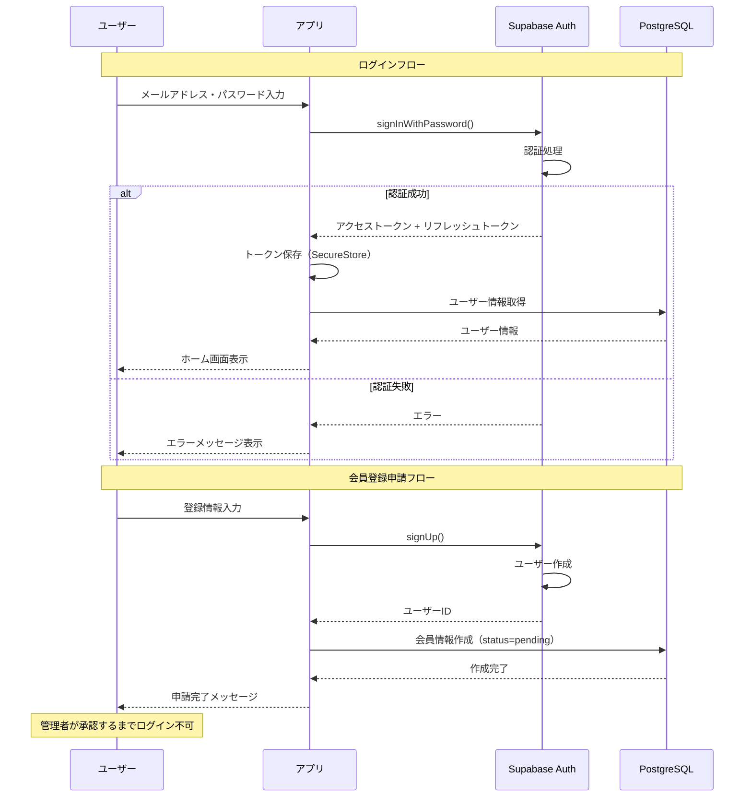

### 8.2 パスワードリセットフロー

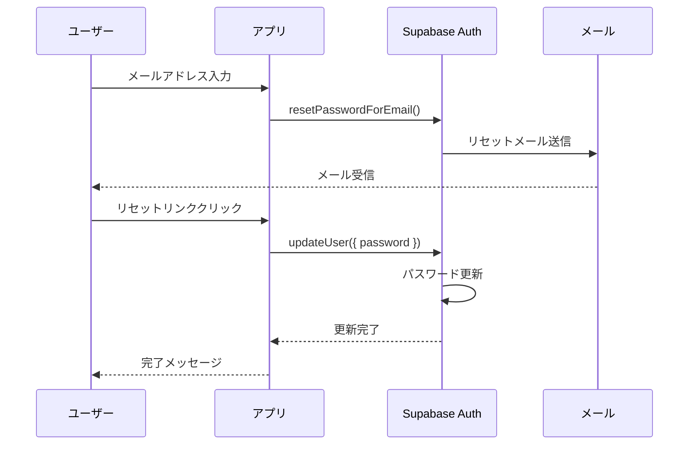

### 8.3 セキュリティ対策

| 対策 | 実装方法 |
|------|----------|
| パスワードハッシュ化 | Supabase Auth標準（bcrypt） |
| トークン保存 | Expo SecureStore |
| API認証 | JWT Bearer Token |
| HTTPS通信 | Supabase標準 |
| RLS（Row Level Security） | Supabase PostgreSQL |
| レート制限 | Supabase標準 |

---

## 9. 通知設計

### 9.1 プッシュ通知

#### 通知種別

| 種別 | トリガー | タイトル例 |
|------|----------|-----------|
| 新着お知らせ | お知らせ公開時 | 新しいお知らせがあります |
| 新着イベント | イベント公開時 | 新しいイベントが追加されました |
| 申込み確認 | イベント申込み時 | イベント申込みを受け付けました |
| リマインド | イベント前日 | 明日開催のイベントがあります |
| 会員承認 | 管理者承認時 | 会員登録が承認されました |

#### 実装方法

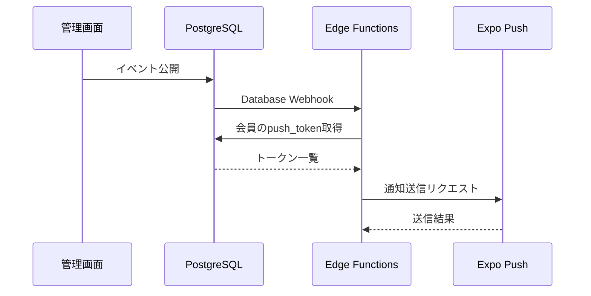

### 9.2 メール通知

#### 通知種別

| 種別 | トリガー | 件名例 |
|------|----------|--------|
| パスワードリセット | リセット要求時 | パスワードリセットのご案内 |
| 会員登録申請受付 | 登録申請時 | 会員登録申請を受け付けました |
| 会員承認 | 管理者承認時 | 会員登録が承認されました |
| イベント申込み確認 | 申込み時 | イベント申込みを受け付けました |
| イベント申込み確認（非会員） | 申込み時 | イベント申込みを受け付けました |

#### 実装方法（Resend）

```typescript
// Edge Function例
import { Resend } from 'resend';

const resend = new Resend(process.env.RESEND_API_KEY);

await resend.emails.send({
  from: 'noreply@example.com',
  to: user.email,
  subject: 'イベント申込みを受け付けました',
  html: `
    <h1>${event.title}</h1>
    <p>開催日: ${event.event_date}</p>
    <p>場所: ${event.venue}</p>
  `
});
```

---

## 10. 開発フェーズ

### 10.1 フェーズ概要

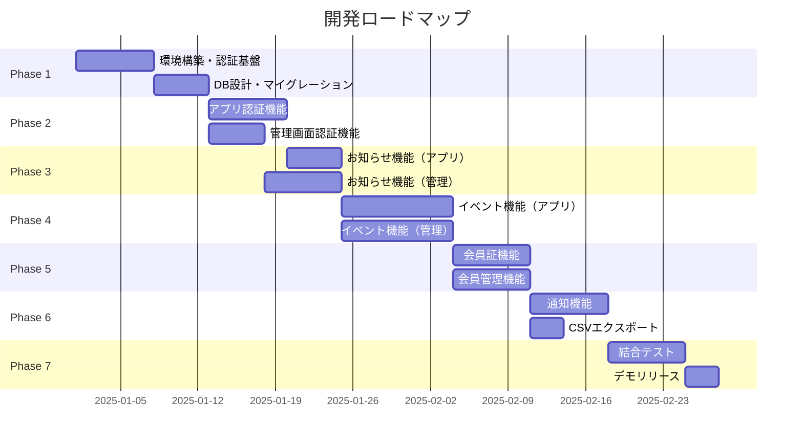

### 10.2 フェーズ詳細

#### Phase 1: 環境構築（1-2週間）
- [ ] Supabase プロジェクト作成
- [ ] Expo プロジェクト作成
- [ ] Next.js プロジェクト作成（管理画面）
- [ ] Next.js プロジェクト作成（非会員申込ページ）
- [ ] データベーススキーマ作成
- [ ] RLS ポリシー設定
- [ ] Supabase Storage バケット設定

#### Phase 2: 認証機能（1-2週間）
- [ ] アプリ：ログイン画面
- [ ] アプリ：会員登録申請画面
- [ ] アプリ：パスワードリセット画面
- [ ] 管理画面：ログイン画面
- [ ] 管理画面：パスワードリセット画面
- [ ] 認証状態管理（Context/Zustand）

#### Phase 3: お知らせ機能（1-2週間）
- [ ] アプリ：お知らせ一覧画面
- [ ] アプリ：お知らせ詳細画面
- [ ] 管理画面：お知らせ一覧画面
- [ ] 管理画面：お知らせ作成/編集画面（リッチエディタ）
- [ ] 公開予約機能

#### Phase 4: イベント機能（2-3週間）
- [ ] アプリ：イベントスケジュール画面
- [ ] アプリ：イベント詳細画面
- [ ] アプリ：申込みフォーム
- [ ] アプリ：参加履歴画面（未来/過去フィルター）
- [ ] アプリ：イベント報告記画面（WebView）
- [ ] 非会員申込ページ
- [ ] 管理画面：イベント一覧画面
- [ ] 管理画面：イベント作成/編集画面
- [ ] 管理画面：申込み一覧画面
- [ ] 定員管理・キャンセル機能

#### Phase 5: 会員管理機能（1-2週間）
- [ ] アプリ：会員証画面
- [ ] アプリ：プロフィール編集画面
- [ ] アプリ：サークル選択モーダル
- [ ] 管理画面：会員一覧画面
- [ ] 管理画面：会員詳細/編集画面
- [ ] 管理画面：会員承認/却下機能
- [ ] 管理画面：サークルマスタ管理

#### Phase 6: 通知・エクスポート機能（1週間）
- [ ] プッシュ通知設定（Expo）
- [ ] Edge Functions（通知送信）
- [ ] メール送信設定（Resend）
- [ ] CSVエクスポート機能

#### Phase 7: テスト・リリース（1週間）
- [ ] 結合テスト
- [ ] UIレビュー
- [ ] パフォーマンステスト
- [ ] デモ環境リリース

---

## 11. 本番移行計画（Supabase → AWS）

### 11.1 移行対象

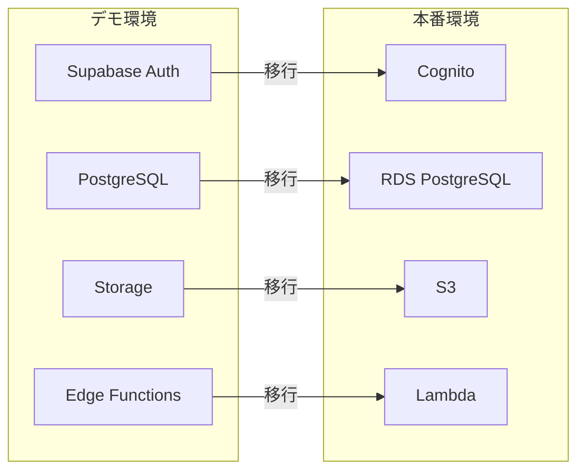

### 11.2 移行手順

#### Step 1: インフラ構築
1. VPC・サブネット構築
2. RDS PostgreSQL 作成
3. Cognito ユーザープール作成
4. S3 バケット作成
5. Lambda 関数作成
6. API Gateway 設定
7. Amplify プロジェクト作成

#### Step 2: データ移行
1. PostgreSQL データエクスポート（pg_dump）
2. RDS へインポート（pg_restore）
3. Storage ファイルを S3 へ移行
4. ユーザー認証情報の移行（Cognito インポート）

#### Step 3: アプリケーション更新
1. 環境変数の切り替え
2. Supabase Client → AWS SDK/Amplify に置き換え
3. 認証処理の置き換え
4. API エンドポイントの変更

#### Step 4: テスト・切り替え
1. ステージング環境でテスト
2. DNS 切り替え
3. 本番稼働確認

### 11.3 移行を容易にするための設計方針

| 方針 | 説明 |
|------|------|
| DB設計の統一 | PostgreSQL を使用し、RDS 移行時もスキーマ変更不要 |
| 認証抽象化 | 認証ロジックをカスタムフックに集約し、置き換えを容易に |
| API抽象化 | Supabase Client をラップし、AWS SDK への置き換えを容易に |
| 環境変数管理 | 環境ごとに設定を分離 |

---

## 12. 補足資料

### 12.1 リッチエディタ要件

管理画面のリッチエディタ（TipTap）でサポートする機能：

| 機能 | 説明 |
|------|------|
| テキスト装飾 | 太字、斜体、下線、取り消し線、文字色 |
| 見出し | H1, H2, H3 |
| リスト | 箇条書き、番号付きリスト |
| リンク | URL挿入 |
| 画像 | 画像アップロード・埋め込み |
| YouTube | YouTube URL から埋め込み |
| テーブル | 行列操作可能なテーブル |

### 12.2 ディレクトリ構成案

#### モバイルアプリ（Expo）
```
app/
├── (auth)/
│   ├── login.tsx
│   ├── register.tsx
│   └── reset-password.tsx
├── (tabs)/
│   ├── _layout.tsx
│   ├── news/
│   │   ├── index.tsx
│   │   └── [id].tsx
│   ├── events/
│   │   ├── index.tsx
│   │   └── [id].tsx
│   ├── history.tsx
│   ├── reports.tsx
│   └── member/
│       ├── index.tsx
│       └── edit.tsx
├── _layout.tsx
└── index.tsx
src/
├── components/
├── hooks/
├── lib/
│   └── supabase.ts
├── stores/
└── types/
```

#### 管理画面（Next.js）
```
app/
├── admin/
│   ├── layout.tsx
│   ├── page.tsx
│   ├── login/
│   ├── members/
│   ├── news/
│   ├── events/
│   ├── circles/
│   └── administrators/
├── apply/
│   └── [eventId]/
│       ├── page.tsx
│       └── complete/
└── layout.tsx
src/
├── components/
├── hooks/
├── lib/
│   └── supabase.ts
└── types/
```

---

## 更新履歴

| 日付 | バージョン | 内容 |
|------|-----------|------|
| 2025-01-XX | 1.0 | 初版作成 |
